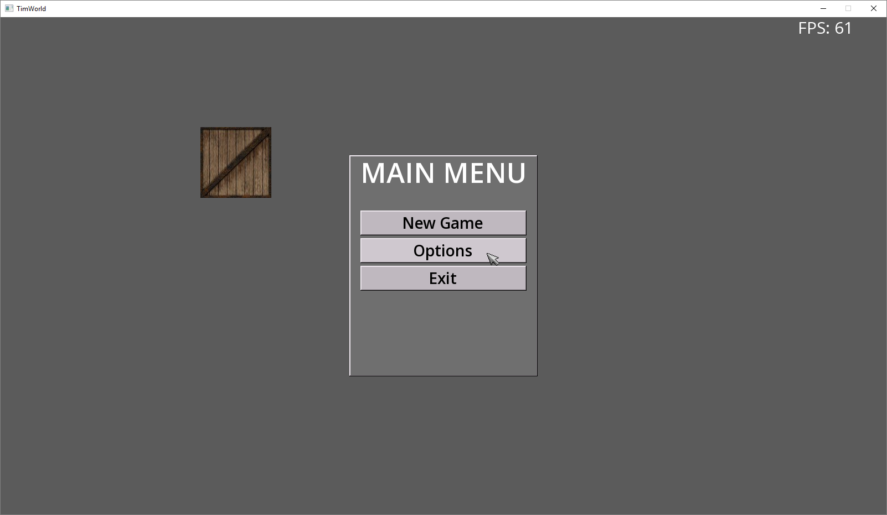
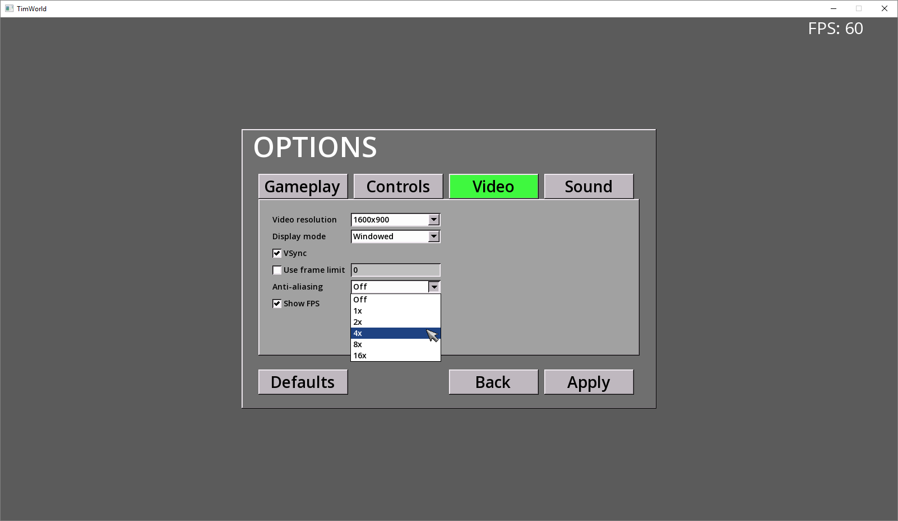
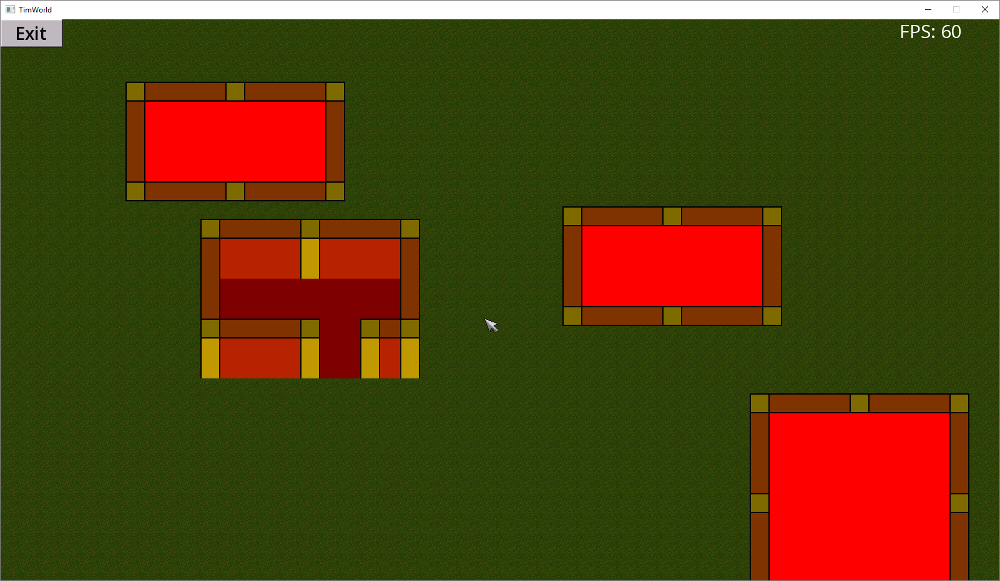

# TimWorld

Description:
A game engine project where I wanted to get the GUI to look similar to Windows 98. This project uses state machine (FSM) to manage stuff like the options menu, loading and running the game. In some sense you could view each game state as a mini program within the game application. Settings are read at startup and written when changes are applied. The project is setup to use precompiled header file, which speeds up the compiling process. Shared context makes it easier to get access to parts of the engine. Its a nice little pointer bag. I also included some logging feature, this was really handy when setting up the game stats correctly. Order of how something is loaded in and unloaded is importent for cleaning up the state. Also included some utility classes for handling strings and detecting OS.

Tags: C++, SFML, UI, PCH, Game Engine, Shared Context, FSM, Shader, Menu, Logging, Utils, Settings
